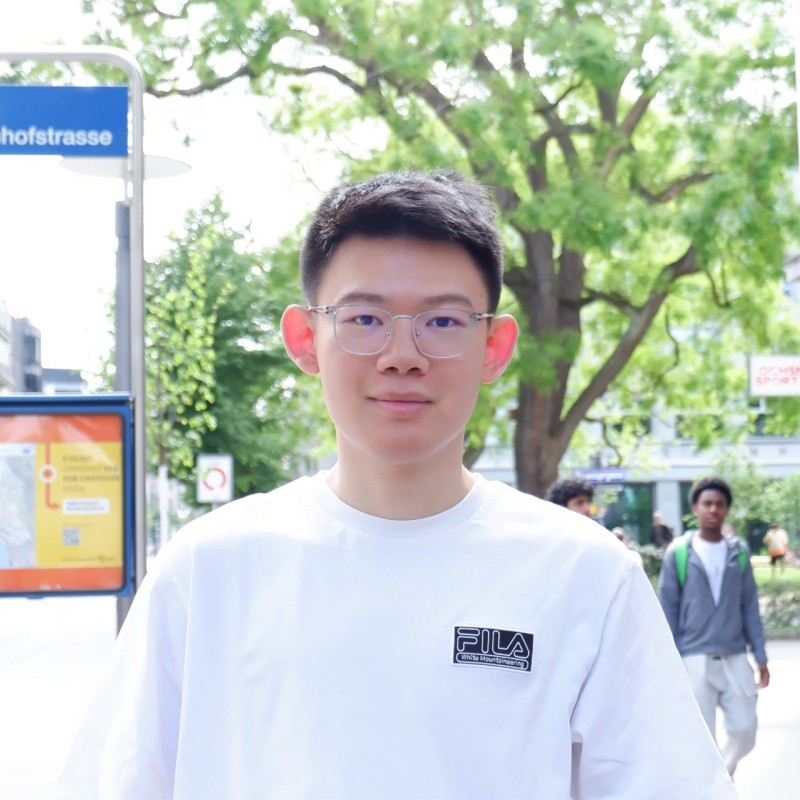

# Academic Page Story of Shizheng Wen

##

## About Me

I am Shizheng Wen (闻仕政), a first-year PhD student in AI and applied math at [ETH Zurich](https://ethz.ch/en.html). My research sits at the intersection of scientific computing and machine learning, with a focus on building fast, scalable, and differentiable solvers for partial differential equations (PDEs).

My current work spans three directions:

- **Differentiable solvers.** I am the creator of [TensorMesh](https://www.tensor-mesh.com/) — a GPU-native differentiable finite-element library built on PyTorch — and [torch-sla](https://www.torchsla.com/), a differentiable sparse linear algebra library with full autograd support across multiple solver backends. Together they aim to make classical numerical methods first-class citizens in modern ML pipelines.
- **Scalable neural solver backbones.** I develop neural operator architectures that handle complex geometries and scale to large problems, including [GAOT](https://camlab-ethz.github.io/GAOT/) and [RIGNO](https://arxiv.org/abs/2501.19205).
- **PDE foundation models.** I am working on large-scale pretraining of foundation models for PDEs across diverse physical systems (more details coming soon).

In the past, I have had the honor of working with Prof. [Earl Dowell](https://mems.duke.edu/faculty/earl-dowell) at Duke University, and Prof. [Wanlin Guo](https://ifs.nuaa.edu.cn/ifs/2021/1119/c16705a279074/page.htm) and Prof. [Xianglei Liu](https://scholar.google.com/citations?hl=en&user=RxW3otEAAAAJ&view_op=list_works&sortby=pubdate) at NUAA.

PDEs are the language of natural science, governing everything from fluid dynamics to quantum mechanics. As an enthusiast of mathematics, physics, and biology, I love integrating multidisciplinary perspectives to tackle complex problems. If you'd like to connect or collaborate, feel free to reach out!

## Links

[Email](mailto:shizheng.wen@sam.math.ethz.ch)
[Google Scholar](https://scholar.google.com/citations?user=PV4NVPgAAAAJ)
[GitHub](https://github.com/Shizheng-Wen)
[LinkedIn](https://www.linkedin.com/in/shizheng-wen-1599b0184/)
[Twitter / X](https://x.com/WenShizheng)
[Resume](shizheng-wen-cv.pdf)

## News
+ May 2026: We open-sourced [TensorMesh](https://www.tensor-mesh.com/)! A fast, differentiable, JIT-free, debugging-friendly finite element library for PyTorch.

+ May 2026: I received ETH Medal at my master's graduation ceremony, the highest honor for students with  outstanding master's and doctoral theses.

+ Apr 2026: One paper "[TensorGalerkin](https://arxiv.org/abs/2602.05052)" accepted at **ICML 2026**.

+ Feb 2026: We open-sourced [torch-sla](https://www.torchsla.com/)! A memory-efficient, differentiable sparse linear equation solver library for PyTorch with multiple backends. Corresonding paper on [arxiv](https://arxiv.org/abs/2601.13994). 

+ Jan 2026: One paper "[MOSIV](https://arxiv.org/abs/2603.06022)" accepted at **ICLR 2026**.

+ Sep 2025: Two papers ("[GAOT](https://arxiv.org/abs/2505.18781)" and "[RIGNO](https://arxiv.org/abs/2501.19205)") accepted at **NeurIPS 2025**.

+ May 2025: Started my Ph.D. journey at the Seminar for Applied Mathematics, ETH Zurich.

+ Apr 2024: One paper "[Phase-field simulation and machine learning of low-field magneto-elastocaloric effect in a multiferroic composite](https://www.sciencedirect.com/science/article/abs/pii/S0020740324003588)" accepted at **International Journal of Mechanical Sciences (IJMS)**.

+ Nov 2023: One paper "[Feature identification in complex fluid flows by convolutional neural networks](https://www.sciencedirect.com/science/article/pii/S2095034923000533)" accepted at **Theoretical and Applied Mechanics Letters (TAML)**.

+ Jul 2022: One paper "[A machine learning strategy for modeling and optimal design of near-field radiative heat transfer](https://pubs.aip.org/aip/apl/article-abstract/121/7/071101/2834033/A-machine-learning-strategy-for-modeling-and?redirectedFrom=fulltext)" accepted at **Applied Physics Letters (APL)**.

## Publications
+ Learning, Solving and Optimizing PDEs with TensorGalerkin: an efficient high-performance Galerkin assembly algorithm, Shizheng Wen^*, Mingyuan Chi^*, Tianwei Yu, Ben Moseley, Mike Yan Michelis, Pu Ren, Hao Sun, Siddhartha Mishra, ICML 2026. [arXiv](https://arxiv.org/abs/2602.05052)· [code](https://github.com/camlab-ethz/TensorMesh) · [project](https://www.tensor-mesh.com/)

+ torch-sla: Differentiable Sparse Linear Algebra with Adjoint Solvers and Sparse Tensor Parallelism for PyTorch, Mingyuan Chi^*, Shizheng Wen^*, [arXiv](https://arxiv.org/pdf/2601.13994)· [code](https://github.com/sparsexlab/torch-sla) · [project](https://www.torchsla.com/)

+ MOSIV: Multi-Object System Identification from Videos, Chunjiang Liu, Xiaoyuan Wang, Qingran Lin, Albert Xiao, Haoyu Chen, Shizheng Wen, Hao Zhang, Lu Qi, Ming-Hsuan Yang, Laszlo A. Jeni, Min Xu, Yizhou Zhao, ICLR 2026. [arXiv](https://arxiv.org/abs/2603.06022)· [code](https://huggingface.co/datasets/Hanibel/MOSIV)

+ Geometry Aware Operator Transformer as an Efficient and Accurate Neural Surrogate for PDEs on Arbitrary Domains, Shizheng Wen, Arsh Kumbhat, Levi Lingsch, Sepehr Mousavi, Yizhou Zhao, Praveen Chandrashekar, and Siddhartha Mishra, NeurIPS 2025. [arXiv](https://arxiv.org/abs/2505.18781) · [code](https://github.com/shizheng-wen/GAOT) · [project](https://camlab-ethz.github.io/GAOT/)

+ RIGNO: A Graph-based framework for robust and accurate operator learning for PDEs on arbitrary domains, Sepehr Mousavi, Shizheng Wen, Levi Lingsch, Maximilian Herde, Bogdan Raonić, and Siddhartha Mishra, NeurIPS 2025. [arXiv](https://arxiv.org/abs/2501.19205) · [code](https://github.com/camlab-ethz/rigno)

+ Phase-field simulation and machine learning of low-field magneto-elastocaloric effect in a multiferroic composite, Wei Tang, Shizheng Wen, Huilong Hou, Qihua Gong, Min Yi, and Wanlin Guo, International Journal of Mechanical Sciences, 2024. [doi](https://doi.org/10.1016/j.ijmecsci.2024.109316)

+ Feature Identification in Complex Fluid Flows by Convolutional Neural Networks, Shizheng Wen, Michael W. Lee, Kai M. Kruger Bastos, Ian Eldridge-Allegra, and Earl H. Dowell, Theoretical and Applied Mechanics Letters, 2023. [doi](https://doi.org/10.1016/j.taml.2023.100482)

+ A machine learning strategy for modeling and optimal design of near-field radiative heat transfer, Shizheng Wen, Chunzhuo Dang, and Xianglei Liu, Applied Physics Letters, 2022. [doi](https://doi.org/10.1063/5.0103363)

+ High-performance three-body near-field thermophotovoltaic energy conversion, Chunzhuo Dang, Xianglei Liu, Haifeng Xia, Shizheng Wen, and Qiao Xu, Journal of Quantitative Spectroscopy and Radiative Transfer, 2021. [doi](https://doi.org/10.1016/j.jqsrt.2020.107411)

+ Ultrahigh thermal rectification based on near-field thermal radiation between dissimilar nanoparticles, Shizheng Wen, Xianglei Liu, Sheng Cheng, Zhoubing Wang, Shenghao Zhang, and Chunzhuo Dang, Journal of Quantitative Spectroscopy and Radiative Transfer, 2019. [doi](https://doi.org/10.1016/j.jqsrt.2019.05.026)

## Selected Awards

+ ICML Gold Reviewer, 2026

+ ETH Medal (top 2.5%), 2026

+ National Scholarship (top 1%), 2019

+ NUAA Presidential Fellowship (top 0.1%), 2019

## Invited Talks

+ Mar 2026: Learning, Solving and Optimizing PDEs with TensorGalerkin: an Efficient High-Performance Galerkin Assembly Algorithm, Simon Fraser University, hosted by Wuyang Chen.

+ Mar 2026: Geometry Aware Operator Transformer as an Efficient and Accurate Neural Surrogate for PDEs on Arbitrary Domains, Tsinghua University, hosted by Angelica Aviles-Rivero.

+ Dec 2025: Accelerating Computational Science: From Differentiable Solvers to Geometry Aware Operator Transformers, Stanford University, hosted by Charbel Farhat.

## Teaching

+ 2026 Spring, 401-0674-00L Numerical Methods for Partial Differential Equations (10 ECTS), [Link](https://www.vvz.ethz.ch/Vorlesungsverzeichnis/lerneinheit.view?semkez=2026S&ansicht=LERNMATERIALIEN&lerneinheitId=198602&lang=en)

+ 2025 Fall, 401-4656-21L AI in the Sciences and Engineering (6 ECTS), [Link](https://camlab-ethz.github.io/ai4s-course/)

